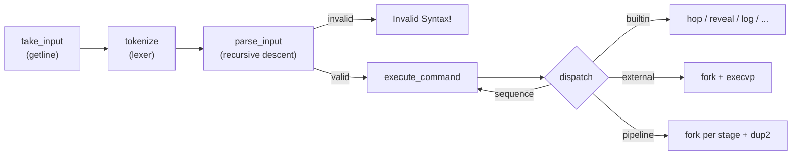

# Architecture

The shell is a straight line from keystrokes to processes:

```
take_input ──▶ tokenize ──▶ parse_input ──▶ execute_command
 (getline)     (lexer)      (validate)       (dispatch & run)
```



Each stage lives in its own module under [../shell/src](../shell/src), with a matching header in [../shell/include](../shell/include). The loop that ties them together is `shell_loop()` in [../shell/src/main.c](../shell/src/main.c).

## Grammar

`parse_input` is a recursive-descent validator for this grammar:

```
line   := group ( sep group )*      with an optional trailing '&'
group  := atomic ( '|' atomic )*
atomic := NAME ( NAME | ('<' | '>' | '>>') NAME )*
sep    := ';' | '&'
```

A trailing `&` is accepted (it backgrounds the final group); a trailing `;` and empty groups between two separators are rejected. The parser only decides *well-formedness* — it does not build an AST. On success the executor re-walks the same flat token array; on failure the shell prints `Invalid Syntax!` and reads the next line.

## Tokenizer

[../shell/src/input.c](../shell/src/input.c) lexes the raw line into a `Token[]`. Two decisions matter:

- **Zero-copy tokens.** Each `Token` stores a `type`, a pointer into the original input buffer, and a length — not a copied string. The token array is therefore only valid while that buffer lives, which keeps lexing allocation-free. Argument strings are copied out lazily, later, only for the tokens that become `argv` entries.
- **Operator gluing.** An operator written flush against its operand (`>out.txt`) is split into two tokens — a redirection token and a `NAME` — so the parser and executor treat operands identically whether or not a space was typed.

## Executor

`execute_command` in [../shell/src/execute.c](../shell/src/execute.c) handles one line, peeling work off in precedence order:

1. **Background.** A trailing `&` is stripped and noted.
2. **Sequences.** If `;` is present, the line is split and `execute_command` **recurses** on each segment. A failing segment never aborts the rest (`a ; b` always runs `b`).
3. **Pipelines.** If `|` is present, one child is forked per stage.
4. **Single command.** Otherwise built-ins are matched first; anything else is an external command.

**Built-ins before `exec`.** Built-ins run *in the shell process*, not a child — that is the whole reason they exist. `hop` must change the shell's own working directory, and `log` must read/write the shell's own history; running them in a forked child would change state that dies with the child.

**Pipeline mechanics and the EOF invariant.** For an *N*-stage pipeline the shell creates *N−1* pipes, forks *N* children, and `dup2`s each child's stdin/stdout onto the adjacent pipe ends. The subtle part is closing descriptors: **every child closes all pipe fds after its `dup2`, and the parent closes all of them after forking.** A single leftover write end anywhere keeps a downstream reader from ever seeing EOF, so the pipeline would hang. The pipeline's exit status is that of its last stage, matching POSIX shells.

**Background stdin.** Background children get their stdin redirected from `/dev/null` so a job running without the terminal can never steal keystrokes from the interactive shell.

**Redirection** ([../shell/src/redirection.c](../shell/src/redirection.c)) scans a command's tokens and applies **last-one-wins** semantics: in `cmd > a > b`, output goes to `b`. The first stage of a pipeline may take input redirection and the last may take output redirection; interior stages are wired only to pipes.

## Built-ins

| Command | Source | Role |
|---|---|---|
| `hop` | [../shell/src/hop.c](../shell/src/hop.c) | `cd`; supports `~`, `..`, `-` (previous dir), and multi-arg chains |
| `reveal` | [../shell/src/reveal.c](../shell/src/reveal.c) | `ls`; `-a` (hidden), `-l` (one per line), lexicographic sort |
| `log` | [../shell/src/log.c](../shell/src/log.c) | history (max 15, file-backed); `log purge`, `log execute <n>` |
| `ping` | [../shell/src/ping.c](../shell/src/ping.c) | `kill(pid, signal % 32)` |
| `activities` | [../shell/src/background.c](../shell/src/background.c) | list background/stopped jobs, sorted by name |
| `fg` / `bg` | [../shell/src/background.c](../shell/src/background.c) | resume a job in fore/background |

`log` keeps the 15 most recent commands as a fixed-size ring, collapses consecutive duplicates, never records itself, and persists to a dotfile in the shell's home directory so history survives restarts. Its index for `execute` is newest-first (`1` is the last command), inverted into the oldest-first file order.

## Shared state & signals

A few shell-wide globals are owned by [../shell/src/shell_state.c](../shell/src/shell_state.c) (`previous_dir`, `shell_home_dir`) and [../shell/src/execute.c](../shell/src/execute.c) (`fg_pid`, `fg_command`). The foreground pid is the link between the executor and the signal handlers.

[../shell/src/signalling.c](../shell/src/signalling.c) installs handlers for `SIGINT` and `SIGTSTP` but does **not** act on them in the shell — it forwards them to the foreground job's **process group** via a negative pid (`kill(-fg_pid, …)`), so the signal reaches the job and any children it spawned, while the shell itself survives. With no foreground job the signal is swallowed. `Ctrl-Z` additionally parks the stopped job in the background table so it shows up in `activities` and can be resumed with `fg`/`bg`. `Ctrl-D` (EOF) kills outstanding background jobs and exits cleanly.

`check_background_jobs()` runs once before every prompt, reaping finished jobs with `waitpid(WNOHANG)` and printing their completion notices — which is how those messages interleave with the prompt the way an interactive shell expects.

## Memory & error discipline

- **Allocation.** Every `malloc`/`realloc`/`strdup` goes through `xmalloc`/`xrealloc`/`xstrdup` in [../shell/src/util.c](../shell/src/util.c). A command-line shell has no meaningful way to continue after OOM, so these fail fast and loud (print to `stderr`, `exit(1)`). They are marked `__attribute__((returns_nonnull))` so the static analyzer can prove call sites never dereference `NULL`.
- **Errors.** Diagnostics go to `stderr`, results to `stdout`. This matters under pipes and redirection — e.g. a `Command not found!` in a pipeline stage must not be fed into the next stage's input.

## Testing & static analysis

The suite lives in [../shell/tests](../shell/tests) and runs against the built binary:

- **PTY tests** (`pexpect`) drive the shell through a pseudo-terminal — the only way to exercise the prompt, job control, and signals realistically. A shared `ShellFixture` (in `conftest.py`) spawns a fresh shell rooted at a temp directory per test and reads back to the next prompt via a regex.
- **Stream-separation tests** use `subprocess` with independent pipes (where `stdout` and `stderr` don't merge as they do on a PTY) to assert that errors land on `stderr` and only results on `stdout`.

Static analysis is a hard gate: `make analyze` recompiles every source with `gcc -fanalyzer`, and because `-Werror` is in effect, any finding fails the build. The only suppressed check is two `-Wanalyzer-fd-leak` false positives on the redirection `dup2` calls (the analyzer can't model that the redirected descriptor is *meant* to survive into the `execvp`'d child); each is silenced with a narrow, documented `#pragma` so fd-leak detection stays active everywhere else.
